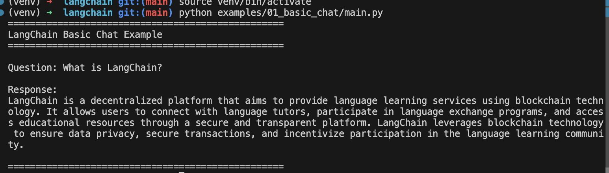
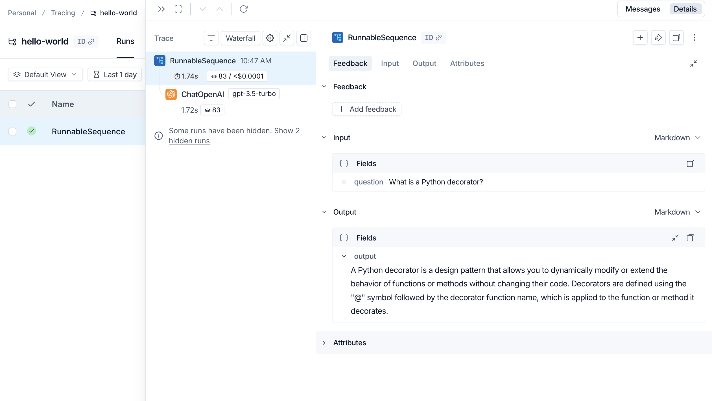

# LangChain Portfolio Projects

A collection of LangChain examples demonstrating AI application development capabilities.

## 🚀 Quick Start

```bash
# Create virtual environment
python3 -m venv venv

# Activate virtual environment
source venv/bin/activate  # On macOS/Linux
# venv\Scripts\activate   # On Windows

# Install dependencies
pip install -r requirements.txt

# Set up environment variables
cp .env.example .env
# Edit .env and add your OPENAI_API_KEY
```

## 📁 Project Structure

```
langchain-portfolio/
├── examples/
│   ├── 01_basic_chat/          # Simple chat completion
│   ├── 02_chains_langsmith/    # Chains with LangSmith tracing
│   └── 03_agent_tavily_search/ # Agent with Tavily search tool
├── screenshots/                # Demo screenshots
├── venv/                       # Virtual environment (not in git)
├── .env                        # API keys (not in git)
├── .env.example               # Template for environment variables
├── .gitignore                 # Git ignore rules
├── requirements.txt           # Python dependencies
└── README.md                  # This file
```

## 🎯 Examples

### 1. Basic Chat
Simple chat completion using OpenAI through LangChain.

```bash
cd examples/01_basic_chat
python main.py
```



[See detailed README](examples/01_basic_chat/README.md)

### 2. Chains with LangSmith
Build a chain using LCEL and integrate with LangSmith for tracing.

```bash
cd examples/02_chains_langsmith
python main.py
```



[See detailed README](examples/02_chains_langsmith/README.md)

### 3. Agent with Tavily Search
Build an agent that uses Tavily search as a tool, with LangSmith tracing.

```bash
cd examples/03_agent_tavily_search
python main.py
```


[See detailed README](examples/03_agent_tavily_search/README.md)

## 🛠️ Technologies

- Python 3.8+
- LangChain
- OpenAI API
- python-dotenv

## 📝 Notes

- Never commit `.env` file with API keys
- Each example includes its own README with screenshots
- Virtual environment is excluded from git
